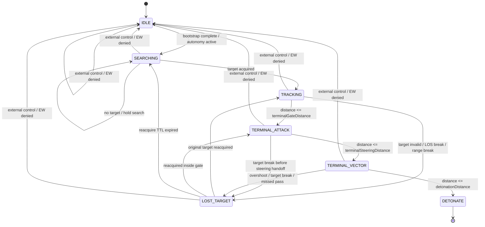

# FPV Aggression Implementation Plan

Date: 2026-05-08

## Purpose

This plan redesigns the active `A3UE_FPV` pursuit stack so the drones feel predatory, locality-safe, and consistent with the existing Antistasi Extender architecture.

The redesign keeps the current event model intact:

- Antistasi events still drive registration and spawning
- server-side manager logic still decides when and what to spawn
- exactly one owner-local controller still drives each UAV
- JIP and ownership handoff safety remain mandatory

The intent is not to replace the current system wholesale. The intent is to harden the behavior layer that sits on top of the existing spawn, bootstrap, and compatibility architecture.

## Current-State Diagnosis

### Doctrine gap

`fn_fpv_buildDoctrine.sqf` currently authors only spawn and composition data:

- `spawnChance`
- `stock`
- `roleWeights`
- `familyWeights`
- `classPools`

The chase controller, however, reads a broader profile surface:

- `trackingSpeed`
- `terminalSpeed`
- `terminalGateDistance`
- `terminalGateDistance2D`
- `detonationDistance`
- `detonationDistance2D`
- `dropTargetDistance`
- `maxLeadTime`
- `trackingMoveDelta`
- `terminalMoveDelta`
- `searchRadius`
- `localSearchRadius`
- `attackHeightASL`

Those keys are not currently authored in doctrine, so the controller is operating almost entirely on fallback defaults.

### Guidance gap

`TRACKING` and `TERMINAL_ATTACK` are both AI `doMove` loops with different refresh rates and different speed defaults. That is enough for a functioning prototype, but it is not enough for aggressive FPV behavior.

### Intelligence gap

The controller has no intermediate reacquisition state. If a target breaks contact, the system drops directly from `TRACKING` back to generic `SEARCHING`.

### Performance coupling gap

High-rate chase logic and lower-rate link-state evaluation are currently coupled inside the same control loop. That blocks aggressive update rates because the hot path includes terrain tests, line intersections, and nearby object scans.

## Redesign Goals

1. Move behavior tuning out of helper fallbacks and into authored doctrine.
2. Scale aggression with the real capability of each supported family.
3. Preserve AI `doMove` for coarse navigation, but replace the final attack segment with owner-local high-authority steering.
4. Add a `LOST_TARGET` state so players cannot evade by forcing one binary target break.
5. Improve selection quality with target stickiness and LOS penalties.
6. Decouple movement rate from EW/link-state rate so aggression does not become CPU-bound.

## Target Architecture

### Design summary

- Keep `SEARCHING` and most of long-range `TRACKING` on AI `doMove`.
- Insert a `LOST_TARGET` state between `TRACKING` and `SEARCHING`.
- Split terminal behavior into:
  - a short AI-guided terminal closure window
  - a high-authority final steering window using direct vector and velocity control
- Move chase behavior values into doctrine-driven profiles keyed by site type, family, and role.
- Cache EW/link-state updates separately from high-rate movement guidance.

## Updated State Machine



### State responsibilities

| State | Responsibility | Update budget |
| --- | --- | --- |
| `IDLE` | Hold safe local state, no active pursuit | `0.50s - 1.00s` |
| `SEARCHING` | Site-centered scan and movement | `0.20s - 0.50s` scan, `1.50s - 2.50s` move refresh |
| `TRACKING` | Coarse interception with adaptive lead and AI navigation | `0.05s - 0.10s` guidance |
| `LOST_TARGET` | Short-lived cone search around last known target motion | `0.05s - 0.10s` guidance, `0.20s` reacquire scan |
| `TERMINAL_ATTACK` | Close AI-guided closure before handoff | `0.03s - 0.05s` |
| `TERMINAL_VECTOR` | High-authority final steering and detonation | `0.01s - 0.02s` |

## 1. Behavioral Doctrine Overhaul

### Proposed doctrine structure

The current doctrine should be expanded, not replaced. Keep the existing spawn keys intact and add a dedicated behavior profile layer.

Recommended structure inside each site entry:

```sqf
private _siteEntry = createHashMapFromArray [
    ["profileId", "site_airport_default"],
    ["spawn", createHashMapFromArray [
        ["spawnChance", 0.60],
        ["stock", [2, 4]],
        ["roleWeights", createHashMapFromArray [["AT", 60], ["AP", 20], ["RECON", 20]]],
        ["familyWeights", _familyWeights],
        ["classPools", [_siteType] call _buildSiteClassPools]
    ]],
    ["behavior", createHashMapFromArray [
        ["profiles", createHashMap],
        ["search", createHashMap],
        ["lostTarget", createHashMap]
    ]]
];
```

Recommended effective lookup key:

`behavior.profiles.<familyId>.<roleId>`

That keeps lookup cheap and avoids repeated recomputation during chase execution.

### Runtime profile resolution contract

`fn_fpv_getProfile.sqf` should continue returning one HashMap, but that HashMap should become the fully resolved behavior profile for the current site type, family, and role.

Recommended resolved keys:

- `trackingSpeed`
- `terminalSpeed`
- `terminalGateDistance`
- `terminalGateDistance2D`
- `terminalSteeringDistance`
- `detonationDistance`
- `detonationDistance2D`
- `dropTargetDistance`
- `trackBreakDistance`
- `searchRadius`
- `localSearchRadius`
- `lostTargetRadius`
- `lostTargetTTL`
- `lostTargetConeHalfAngle`
- `lostTargetClimbAGL`
- `maxLeadTimeFar`
- `maxLeadTimeNear`
- `maxLeadDistance`
- `nearLeadDistance`
- `trackingMoveDelta`
- `terminalMoveDelta`
- `attackHeightASL`
- `trackingHeightASL`
- `terminalTurnBlend`
- `terminalVerticalGain`
- `targetStickyBonus`
- `targetStickyWindow`
- `losBlockedPenalty`

### Aggression model

Aggression should be based on two layers:

1. site pressure
2. family airframe capability

Open-area, higher-value sites should launch faster, longer-range, more persistent profiles. Faster airframes should receive more aggressive speed and gate tuning.

### Airframe capability baselines

Observed representative base-class speed caps from the supported vendor packs:

| Family | Representative airframe cap |
| --- | --- |
| `armafpv` | `190` |
| `kvn` | `145` |
| `fpv_ua` | `120` |

Recommended doctrine safety clamp:

- `trackingSpeed <= airframeMaxSpeed * 0.84`
- `terminalSpeed <= airframeMaxSpeed * 0.96`

This keeps the doctrine aggressive without hardcoding assumptions that could break if external mod caps change.

### Doctrine table schema

The recommended authoring model is:

1. site-role-family effective profile table
2. shared search and lost-target table per site type
3. runtime clamp against airframe max speed

The four required attack-tuning keys are explicitly authored per site, family, and role below.

### Airport behavior profiles

| Family | Role | trackingSpeed | terminalSpeed | terminalGateDistance | detonationDistance |
| --- | --- | ---: | ---: | ---: | ---: |
| `armafpv` | `AT` | `150` | `180` | `100` | `18` |
| `armafpv` | `AP` | `160` | `182` | `92` | `14` |
| `armafpv` | `RECON` | `155` | `175` | `96` | `13` |
| `kvn` | `AT` | `124` | `138` | `96` | `17` |
| `kvn` | `AP` | `128` | `140` | `88` | `13` |
| `kvn` | `RECON` | `126` | `136` | `92` | `12` |
| `fpv_ua` | `AT` | `102` | `114` | `92` | `16` |
| `fpv_ua` | `AP` | `106` | `116` | `84` | `12` |
| `fpv_ua` | `RECON` | `104` | `112` | `88` | `11` |

### Outpost behavior profiles

| Family | Role | trackingSpeed | terminalSpeed | terminalGateDistance | detonationDistance |
| --- | --- | ---: | ---: | ---: | ---: |
| `armafpv` | `AT` | `145` | `172` | `90` | `17` |
| `armafpv` | `AP` | `155` | `176` | `84` | `13` |
| `armafpv` | `RECON` | `150` | `168` | `88` | `12` |
| `kvn` | `AT` | `120` | `134` | `86` | `16` |
| `kvn` | `AP` | `124` | `138` | `80` | `12` |
| `kvn` | `RECON` | `122` | `132` | `84` | `11` |
| `fpv_ua` | `AT` | `98` | `110` | `82` | `15` |
| `fpv_ua` | `AP` | `102` | `114` | `76` | `11` |
| `fpv_ua` | `RECON` | `100` | `108` | `80` | `10` |

### Resource behavior profiles

| Family | Role | trackingSpeed | terminalSpeed | terminalGateDistance | detonationDistance |
| --- | --- | ---: | ---: | ---: | ---: |
| `armafpv` | `AT` | `138` | `165` | `82` | `16` |
| `armafpv` | `AP` | `148` | `170` | `76` | `12` |
| `armafpv` | `RECON` | `143` | `162` | `80` | `11` |
| `kvn` | `AT` | `114` | `128` | `78` | `15` |
| `kvn` | `AP` | `118` | `132` | `72` | `11` |
| `kvn` | `RECON` | `116` | `126` | `76` | `10` |
| `fpv_ua` | `AT` | `94` | `104` | `74` | `14` |
| `fpv_ua` | `AP` | `98` | `108` | `68` | `10` |
| `fpv_ua` | `RECON` | `96` | `102` | `72` | `9` |

### Derived distance rules

To keep the profile surface compact, these values should be derived from the authored tables unless explicitly overridden:

- `terminalGateDistance2D = round (terminalGateDistance * 0.55)`
- `detonationDistance2D = round (detonationDistance * 0.50)`
- `trackBreakDistance = terminalGateDistance + 700` for `Airport`, `+550` for `Outpost`, `+450` for `Resource`
- `dropTargetDistance = trackBreakDistance + 150`

### Site-level search and lost-target tuning

| Site Type | searchRadius | localSearchRadius | lostTargetRadius | lostTargetTTL | lostTargetConeHalfAngle | lostTargetClimbAGL |
| --- | ---: | ---: | ---: | ---: | ---: | ---: |
| `Airport` | `900` | `320` | `220` | `5.0` | `35` | `18` |
| `Outpost` | `650` | `260` | `180` | `4.0` | `30` | `14` |
| `Resource` | `500` | `220` | `140` | `3.0` | `25` | `10` |

### Behavioral implementation notes

- `armafpv` should be the fastest and most punishing family.
- `kvn` should remain aggressive, but slightly smoother and less knife-edge than `armafpv`.
- `fpv_ua` should stay physically limited, but still chase harder than the current fallback-driven controller.
- `AP` should be the most direct anti-personnel hunter.
- `AT` should get earlier terminal entry and larger detonation windows.
- `RECON` should keep respectable strike behavior, but slightly lower terminal closure than `AP`.

## 2. High-Authority Guidance and Adaptive Intercept

### Guidance split

Recommended guidance ownership by distance band:

| Band | Mode | Controller |
| --- | --- | --- |
| `> terminalGateDistance` | `TRACKING` | AI `doMove` + adaptive intercept |
| `terminalGateDistance` down to `terminalSteeringDistance` | `TERMINAL_ATTACK` | AI `doMove` with tighter cadence |
| `<= terminalSteeringDistance` | `TERMINAL_VECTOR` | owner-local direct steering |

Recommended `terminalSteeringDistance` values:

| Family | Airport | Outpost | Resource |
| --- | ---: | ---: | ---: |
| `armafpv` | `92` | `84` | `76` |
| `kvn` | `88` | `80` | `72` |
| `fpv_ua` | `84` | `76` | `68` |

### High-authority terminal steering design

This logic should remain owner-local and should never move to the server. The existing locality model is correct.

Recommended implementation approach:

- add a new helper, e.g. `fn_fpv_runTerminalVector.sqf`
- enter it only after `TERMINAL_ATTACK` crosses `terminalSteeringDistance`
- suppress AI path correction on the crew during the final window
- use direct heading and velocity shaping on the UAV object itself
- restore AI pathing if the drone exits terminal vector control without detonating

### SQF pseudocode: high-authority terminal steering

```sqf
/*
    File: fn_fpv_runTerminalVector.sqf
    Purpose: Owner-local terminal steering for the final strike window.
*/

params ["_uav", "_target", "_profile"];

if (isNull _uav || {isNull _target} || {!local _uav}) exitWith {false};

private _uavPos = getPosASL _uav;
private _targetPos = getPosASL _target;
private _targetVel = velocity _target;

private _leadPos = [_uav, _target, _profile, true] call A3UE_fnc_fpv_computeIntercept;
private _aimVector = vectorNormalized (_leadPos vectorDiff _uavPos);

private _terminalSpeed = [_profile, "terminalSpeed", 120] call A3UE_fnc_fpv_profileValue;
private _turnBlend = [_profile, "terminalTurnBlend", 0.35] call A3UE_fnc_fpv_profileValue;
private _verticalGain = [_profile, "terminalVerticalGain", 0.65] call A3UE_fnc_fpv_profileValue;

private _currentDir = vectorDir _uav;
private _blendedDir = vectorNormalized [
    ((_currentDir select 0) * (1 - _turnBlend)) + ((_aimVector select 0) * _turnBlend),
    ((_currentDir select 1) * (1 - _turnBlend)) + ((_aimVector select 1) * _turnBlend),
    ((_currentDir select 2) * (1 - _turnBlend)) + ((_aimVector select 2) * _turnBlend)
];

private _desiredVelocity = _blendedDir vectorMultiply _terminalSpeed;
private _verticalError = ((_leadPos select 2) - (_uavPos select 2));
_desiredVelocity set [2, (_desiredVelocity select 2) + (_verticalError * _verticalGain)];

{
    _x disableAI "PATH";
    _x disableAI "FSM";
    _x disableAI "AUTOCOMBAT";
} forEach crew _uav;

_uav setVectorDirAndUp [_blendedDir, [0, 0, 1]];
_uav setVelocity _desiredVelocity;

true
```

### Steering safeguards

- never run this unless the UAV is local
- do not enter vector steering if `fn_fpv_isExternallyControlled.sqf` returns true
- if `EW_DENIED`, abort to `IDLE` exactly as the current controller does
- if terminal vector control exits without detonation, restore the crew AI flags before returning to `TRACKING` or `LOST_TARGET`

### Adaptive lead design

The current solver clamps to a single `maxLeadTime`. That should be replaced with a distance-dependent lead cap.

Recommended adaptive lead function:

$$
t_{cap}(d) = \operatorname{lerp}(t_{near}, t_{far}, \operatorname{clamp}(\frac{d - d_{near}}{d_{far} - d_{near}}, 0, 1))
$$

Where:

- $d$ is current UAV-to-target distance
- $t_{near}$ is the low lead cap near terminal closure
- $t_{far}$ is the high lead cap at long range
- $d_{near}$ is the near-distance threshold
- $d_{far}$ is the far-distance threshold

Recommended defaults:

- `maxLeadTimeNear = 0.20 - 0.35`
- `maxLeadTimeFar = 2.00 - 2.80`
- `nearLeadDistance = 60`
- `maxLeadDistance = 500 - 650`

### SQF pseudocode: adaptive lead solver

```sqf
/*
    File: fn_fpv_computeIntercept.sqf
    Purpose: Lead solver with distance-scaled cap for aggressive chase behavior.
*/

params ["_uav", "_target", "_profile", ["_isTerminal", false]];

private _uavPos = getPosASL _uav;
private _targetPos = getPosASL _target;
private _uavVel = velocity _uav;
private _targetVel = velocity _target;
private _relPos = _targetPos vectorDiff _uavPos;
private _relVel = _targetVel vectorDiff _uavVel;
private _distance = vectorMagnitude _relPos;

private _speedKey = ["trackingSpeed", "terminalSpeed"] select _isTerminal;
private _chaseSpeed = [_profile, _speedKey, 100] call A3UE_fnc_fpv_profileValue;

private _a = (_relVel vectorDotProduct _relVel) - (_chaseSpeed * _chaseSpeed);
private _b = 2 * (_relPos vectorDotProduct _relVel);
private _c = _relPos vectorDotProduct _relPos;

private _timeToImpact = 0;
if (abs _a < 0.001) then {
    if (abs _b > 0.001) then {
        _timeToImpact = (-_c / _b) max 0;
    };
} else {
    private _disc = (_b * _b) - (4 * _a * _c);
    if (_disc >= 0) then {
        private _root = sqrt _disc;
        private _t1 = (-_b - _root) / (2 * _a);
        private _t2 = (-_b + _root) / (2 * _a);
        private _valid = [_t1, _t2] select { _x > 0 };
        if (_valid isNotEqualTo []) then {
            _timeToImpact = selectMin _valid;
        };
    };
};

if (_timeToImpact <= 0) then {
    _timeToImpact = (_distance / _chaseSpeed) max 0.05;
};

private _nearCap = [_profile, "maxLeadTimeNear", 0.25] call A3UE_fnc_fpv_profileValue;
private _farCap = [_profile, "maxLeadTimeFar", 2.40] call A3UE_fnc_fpv_profileValue;
private _nearDist = [_profile, "nearLeadDistance", 60] call A3UE_fnc_fpv_profileValue;
private _farDist = [_profile, "maxLeadDistance", 550] call A3UE_fnc_fpv_profileValue;

private _adaptiveCap = linearConversion [_nearDist, _farDist, _distance, _nearCap, _farCap, true];
_timeToImpact = _timeToImpact min _adaptiveCap;

private _heightOffset = [_profile, "attackHeightASL", 8] call A3UE_fnc_fpv_profileValue;
private _intercept = _targetPos vectorAdd (_targetVel vectorMultiply _timeToImpact);
_intercept set [2, (_targetPos select 2) + _heightOffset];

_uav setVariable ["A3UE_FPV_lastLeadTime", _timeToImpact];
_intercept
```

## 3. Predatory Intelligence

### New `LOST_TARGET` state

This state is the missing bridge between `TRACKING` and `SEARCHING`.

It should activate when:

- target object becomes null temporarily
- target exceeds `trackBreakDistance`
- target is alive but line of sight is broken beyond a short grace period
- terminal attack overshoots without detonation

### Stored target memory

On entry into `LOST_TARGET`, persist:

- `A3UE_FPV_lastKnownTargetNetId`
- `A3UE_FPV_lastKnownTargetPosASL`
- `A3UE_FPV_lastKnownTargetVel`
- `A3UE_FPV_lastKnownTargetTime`
- `A3UE_FPV_lostTargetExpireAt`
- `A3UE_FPV_lostTargetOriginASL`

### LOST_TARGET behavior

Recommended behavior per tick:

1. Predict a short extrapolated target origin from last known position and velocity.
2. Climb to a site-appropriate reacquisition height.
3. Fly toward the predicted origin.
4. Search inside a forward cone centered on last known velocity.
5. Prefer reacquiring the original target if it still exists.
6. Fall back to generic `SEARCHING` only after the lost-target TTL expires.

### SQF pseudocode: LOST_TARGET loop

```sqf
/*
    File: fn_fpv_runLostTarget.sqf
    Purpose: Short-duration predatory reacquisition after a track break.
*/

params ["_uav", "_profile"];

private _origin = _uav getVariable ["A3UE_FPV_lastKnownTargetPosASL", []];
private _velocity = _uav getVariable ["A3UE_FPV_lastKnownTargetVel", [0, 0, 0]];
private _ttl = _uav getVariable ["A3UE_FPV_lostTargetExpireAt", time];

if (_origin isEqualTo [] || {time > _ttl}) exitWith {
    _uav setVariable ["A3UE_FPV_mode", "SEARCHING", true];
    false
};

private _predictionAge = time - (_uav getVariable ["A3UE_FPV_lastKnownTargetTime", time]);
private _predictedPos = _origin vectorAdd (_velocity vectorMultiply (_predictionAge min 2));

[_uav, _predictedPos, _profile] call A3UE_fnc_fpv_applyGuidance;

private _reacquired = [_uav, _profile, true] call A3UE_fnc_fpv_selectTarget;
if (!isNull _reacquired) then {
    _uav setVariable ["A3UE_FPV_targetNetId", netId _reacquired, true];
    _uav setVariable ["A3UE_FPV_mode", "TRACKING", true];
};

true
```

### Target stickiness

`fn_fpv_selectTarget.sqf` should gain a sticky-score bonus so the controller does not churn between nearly equivalent nearby targets.

Recommended additions:

- if candidate netId matches current target, add `targetStickyBonus`
- if candidate netId matches last lost target and is inside `targetStickyWindow`, add half bonus
- require a challenger to exceed the current target score by a fixed margin before switching

Recommended defaults:

- `targetStickyBonus = 1800`
- `targetStickyWindow = 4.0s`
- `targetSwitchMargin = 900`

### LOS penalty

Do not hard-reject blocked targets. Use a penalty model instead.

Recommended behavior:

- single hard obstruction: subtract `losBlockedPenalty`
- repeated surface intersections: subtract additional obstruction cost
- if candidate is the sticky target, still allow it unless the obstruction cost is extreme

Recommended defaults:

- `losBlockedPenalty = 2200`
- `obstructionPenaltyStep = 350`

### SQF pseudocode: target stickiness and LOS scoring

```sqf
private _stickyNetId = _uav getVariable ["A3UE_FPV_targetNetId", ""];
private _lostNetId = _uav getVariable ["A3UE_FPV_lastKnownTargetNetId", ""];
private _stickyBonus = [_profile, "targetStickyBonus", 1800] call A3UE_fnc_fpv_profileValue;
private _losBlockedPenalty = [_profile, "losBlockedPenalty", 2200] call A3UE_fnc_fpv_profileValue;

if (netId _target == _stickyNetId) then {
    _score = _score + _stickyBonus;
};

if (netId _target == _lostNetId) then {
    _score = _score + (_stickyBonus * 0.5);
};

private _losBlocked = [_uav, _target] call A3UE_fnc_fpv_isTargetObstructed;
if (_losBlocked) then {
    _score = _score - _losBlockedPenalty;
};
```

## 4. Performance Optimization

### Core rule

Movement guidance and EW/link-state evaluation must stop sharing the same update budget.

### Recommended timing lanes inside `fn_fpv_runController.sqf`

| Lane | Responsibility | Rate |
| --- | --- | --- |
| `guidanceTick` | movement, intercept, terminal steering | `0.01s - 0.10s` depending on state |
| `targetScanTick` | selection and reacquisition scans | `0.20s - 0.50s` |
| `linkTick` | `fn_fpv_evaluateLinkState.sqf` | `0.30s - 0.50s` |
| `debugTick` | optional diagnostics replication | `0.50s - 1.00s` |

### Cache contract

Add these UAV variables:

- `A3UE_FPV_cachedLinkState`
- `A3UE_FPV_cachedSignalStrength`
- `A3UE_FPV_nextLinkEvalAt`
- `A3UE_FPV_lastLinkEvalPosATL`

Recommended invalidation rules:

- TTL expiry
- moved more than `150m` since last evaluation
- entered or exited jammer zone
- terminal handoff began

### SQF pseudocode: decoupled link evaluation

```sqf
private _cachedLinkState = _uav getVariable ["A3UE_FPV_cachedLinkState", "OK"];
private _nextLinkEvalAt = _uav getVariable ["A3UE_FPV_nextLinkEvalAt", 0];
private _lastLinkPos = _uav getVariable ["A3UE_FPV_lastLinkEvalPosATL", getPosATL _uav];

if (time >= _nextLinkEvalAt || {(_uav distance2D _lastLinkPos) > 150}) then {
    _cachedLinkState = [_uav, _profile] call A3UE_fnc_fpv_evaluateLinkState;
    _uav setVariable ["A3UE_FPV_cachedLinkState", _cachedLinkState, true];
    _uav setVariable ["A3UE_FPV_nextLinkEvalAt", time + 0.35];
    _uav setVariable ["A3UE_FPV_lastLinkEvalPosATL", getPosATL _uav];
};
```

### Expected performance outcome

This change allows:

- `TERMINAL_VECTOR` updates at `0.01s - 0.02s`
- `TRACKING` guidance at `0.05s`
- without paying full terrain and object-query cost on every movement tick

## File-Level Implementation Plan

### Existing files to update

- `functions/fpv/fn_fpv_buildDoctrine.sqf`
  - add behavior profile authoring and runtime clamps
- `functions/fpv/fn_fpv_getProfile.sqf`
  - resolve site + family + role behavior profile, not just site spawn profile
- `functions/fpv/fn_fpv_runController.sqf`
  - add timing lanes, `LOST_TARGET`, and terminal vector handoff
- `functions/fpv/fn_fpv_computeIntercept.sqf`
  - replace fixed lead cap with adaptive lead
- `functions/fpv/fn_fpv_selectTarget.sqf`
  - add optional sticky target context and LOS penalties
- `functions/fpv/fn_fpv_runTerminal.sqf`
  - narrow to coarse terminal closure only
- `functions/fpv/fn_fpv_shouldEnterTerminal.sqf`
  - use doctrine-authored gate distances
- `functions/fpv/fn_fpv_shouldDetonateNow.sqf`
  - use doctrine-authored detonation windows

### New files to add

- `functions/fpv/fn_fpv_runLostTarget.sqf`
- `functions/fpv/fn_fpv_runTerminalVector.sqf`
- `functions/fpv/fn_fpv_cacheLinkState.sqf`
- `functions/fpv/fn_fpv_isTargetObstructed.sqf`

### Config update requirement

If new runtime functions are added, `config.cpp` `CfgFunctions` must be updated in sync with the new SQF files.

## Validation Plan

### Reacquisition tests

1. Infantry lateral jink at `120m`.
   Expected result: drone transitions `TRACKING -> LOST_TARGET -> TRACKING` without dropping to `SEARCHING` if the same target reappears within TTL.

2. Infantry temporary building break for `2.5s`.
   Expected result: drone flies the predicted cone, preserves sticky target identity, and reacquires if the target exits the same side of cover.

3. Vehicle hard break with terrain crest.
   Expected result: `LOST_TARGET` uses last velocity and predicted crest exit instead of generic site orbit.

4. Overshoot miss in terminal vector mode.
   Expected result: drone enters `LOST_TARGET`, attempts one reacquire pass, and only then abandons pursuit.

### Intercept accuracy tests

1. `armafpv` vs running infantry on open ground from `250m` start.
   Acceptance target: hit or valid detonation pass in at least `8/10` runs.

2. `kvn` vs wheeled vehicle crossing at `15 - 20 m/s`.
   Acceptance target: median miss distance before detonation window under `6m`.

3. `fpv_ua` vs sprinting infantry zig-zag.
   Acceptance target: still physically limited, but materially harder to sidestep than the current fallback controller.

4. Terminal steering handoff distance validation.
   Acceptance target: transition to `TERMINAL_VECTOR` always happens inside the authored `terminalSteeringDistance` band and never while the UAV is remote-owned.

### Target-selection tests

1. Two infantry cross paths at similar range.
   Acceptance target: current target remains locked unless challenger exceeds `targetSwitchMargin`.

2. Sticky target briefly behind cover while a second visible target enters range.
   Acceptance target: blocked sticky target is preferred during the sticky window unless obstruction penalty becomes extreme.

3. Vehicle plus exposed infantry in mixed scene.
   Acceptance target: role weighting still dominates selection, but LOS penalties suppress obviously bad picks.

### Performance tests

1. Eight active drones, mixed families, no jammers.
   Acceptance target: link-state evaluation occurs on TTL cadence rather than every terminal movement tick.

2. Eight active drones, jammer and retranslator present.
   Acceptance target: EW state changes are reflected within `0.35s - 0.50s`, with no duplicate link evaluations per tick.

3. Headless client ownership handoff during `TRACKING` and `TERMINAL_ATTACK`.
   Acceptance target: exactly one controller remains active, and vector steering never runs on the old owner after locality transfer.

### Debug instrumentation additions

Recommended variables for temporary tuning and validation:

- `A3UE_FPV_lastLeadTime`
- `A3UE_FPV_lastKnownTargetPosASL`
- `A3UE_FPV_lastKnownTargetVel`
- `A3UE_FPV_cachedLinkState`
- `A3UE_FPV_terminalSteeringActive`
- `A3UE_FPV_lastTargetScore`
- `A3UE_FPV_lastTargetScoreBreakdown`

Extending `fn_fpv_debugSnapshot.sqf` to include these values will make tuning materially faster.

## Recommended Delivery Sequence

1. Expand `fn_fpv_buildDoctrine.sqf` and `fn_fpv_getProfile.sqf` so behavior values become authored data.
2. Refactor `fn_fpv_runController.sqf` into separate timing lanes and cached link-state handling.
3. Add `LOST_TARGET` and target memory persistence.
4. Update `fn_fpv_selectTarget.sqf` for stickiness and LOS penalties.
5. Replace fixed lead logic in `fn_fpv_computeIntercept.sqf` with adaptive lead.
6. Split `fn_fpv_runTerminal.sqf` into coarse terminal closure plus `fn_fpv_runTerminalVector.sqf`.
7. Extend debug snapshot output and run the validation matrix.

## Final Recommendation

The correct redesign is evolutionary, not revolutionary.

The existing A3UE ownership model, Antistasi event integration, and compatibility scaffolding are already good enough. The missing work is concentrated in four areas:

- authored behavior doctrine
- aggressive terminal steering
- target memory and reacquisition
- update-rate decoupling for performance

If those four areas are implemented in the order above, the drones should stop feeling like cautious autonomous UAVs and start behaving like deliberate FPV strike threats.