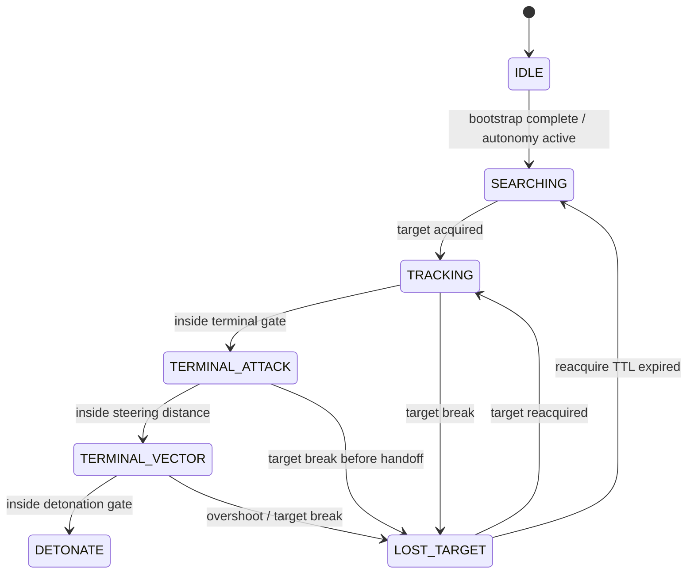

# FPV Aggression and Terminal Vector

Date: 2026-05-12

## Scope

This document is the single design, execution, and validation reference for the FPV aggression redesign. It combines the broader predatory-behavior plan with the focused terminal-vector smoothing follow-on.

The combined feature scope is:

- doctrine-authored aggression profiles;
- expanded pursuit state handling, including `LOST_TARGET` and `TERMINAL_VECTOR`;
- adaptive intercept, sticky target selection, and LOS-aware scoring;
- decoupled movement and link-evaluation timing lanes;
- acceleration-limited terminal-vector steering and telemetry-backed smoothing validation.

## Executive Summary

The existing A3UE ownership model, Antistasi event integration, and compatibility scaffolding are sound. The missing work is in the pursuit layer:

- authored behavior doctrine was incomplete;
- pursuit dropped too quickly from `TRACKING` back to `SEARCHING`;
- high-rate guidance and lower-rate link evaluation were too tightly coupled;
- terminal-vector steering snapped too aggressively to full speed.

The correct redesign is evolutionary:

1. author aggression in doctrine rather than relying on helper fallbacks;
2. add target memory and a real `LOST_TARGET` state;
3. retune coarse interception with adaptive lead and separate timing lanes;
4. keep owner-local vector steering, but make it acceleration-limited and observable through telemetry.

## Current-State Diagnosis

### Aggression and controller gaps

- `fn_fpv_buildDoctrine.sqf` originally authored spawn and composition data only.
- Chase behavior needed explicit keys such as `trackingSpeed`, `terminalSpeed`, `terminalGateDistance`, `detonationDistance`, `maxLeadTime`, `searchRadius`, and related movement cadence values.
- `TRACKING` and `TERMINAL_ATTACK` were both AI `doMove` loops with different refresh rates, but without a predatory intermediate state.
- Target loss dropped directly to `SEARCHING` and made the drone too easy to evade.
- High-rate chase logic and lower-rate link-state evaluation were coupled inside the same loop.

### Terminal-vector smoothing gap

The final-dive "zoom" effect was not just tuning noise. It came from a control-law mismatch:

1. `TERMINAL_VECTOR` begins close to the target;
2. the update loop runs at very high cadence;
3. direction is re-vectorized immediately;
4. speed was being set directly to the full terminal target instead of ramped;
5. one overloaded `terminalSpeed` concept was being used across AI closure, intercept prediction, and direct vector control.

## Redesign Goals

1. Move behavior tuning out of helper fallbacks and into doctrine.
2. Scale aggression with site pressure and family airframe capability.
3. Preserve AI `doMove` for coarse navigation, but add stronger owner-local terminal steering.
4. Add `LOST_TARGET` so players cannot break pursuit by one temporary LOS break.
5. Improve target selection with stickiness and LOS penalties.
6. Decouple movement guidance from lower-rate EW evaluation so aggression is not CPU-bound.
7. Keep terminal-vector steering aggressive while removing instant full-speed snap on entry.

## Target Architecture

### Updated state model



### State responsibilities

| State | Responsibility | Typical cadence |
| --- | --- | --- |
| `IDLE` | Safe local standby and suspend state | `0.50s - 1.00s` |
| `SEARCHING` | Site-centered scan and movement | `0.20s - 0.50s` scan, `1.50s - 2.50s` move refresh |
| `TRACKING` | Coarse interception with AI navigation and adaptive lead | `0.05s - 0.10s` guidance |
| `LOST_TARGET` | Predatory cone search around last known motion | `0.05s - 0.10s` guidance, `0.20s` reacquire scan |
| `TERMINAL_ATTACK` | Close AI-guided closure before direct steering handoff | `0.03s - 0.05s` |
| `TERMINAL_VECTOR` | Owner-local high-authority final steering | `0.01s - 0.02s` |

## Doctrine Contract

### Behavior profile structure

Each site entry should keep its existing spawn data and add a behavior layer:

- `spawn.spawnChance`
- `spawn.stock`
- `spawn.roleWeights`
- `spawn.familyWeights`
- `spawn.classPools`
- `behavior.profiles.<familyId>.<roleId>`
- `behavior.search`
- `behavior.lostTarget`

`fn_fpv_getProfile.sqf` should return the fully resolved behavior profile for the UAV's `siteType`, `vendorId`, and `payloadRole`.

### Required aggression keys

- `trackingSpeed`
- `terminalSpeed`
- `terminalGateDistance`
- `terminalGateDistance2D`
- `terminalSteeringDistance`
- `detonationDistance`
- `detonationDistance2D`
- `dropTargetDistance`
- `trackBreakDistance`
- `searchRadius`
- `localSearchRadius`
- `lostTargetRadius`
- `lostTargetTTL`
- `lostTargetConeHalfAngle`
- `lostTargetClimbAGL`
- `maxLeadTimeNear`
- `maxLeadTimeFar`
- `nearLeadDistance`
- `maxLeadDistance`
- `trackingMoveDelta`
- `terminalMoveDelta`
- `attackHeightASL`
- `trackingHeightASL`
- `terminalTurnBlend`
- `terminalVerticalGain`
- `targetStickyBonus`
- `targetStickyWindow`
- `losBlockedPenalty`

### Representative family capability baselines

| Family | Representative cap |
| --- | ---: |
| `armafpv` | `190` |
| `kvn` | `145` |
| `fpv_ua` | `120` |

Recommended clamps:

- `trackingSpeed <= airframeMaxSpeed * 0.84`
- `terminalSpeed <= airframeMaxSpeed * 0.96`

### Search and lost-target tuning

| Site Type | searchRadius | localSearchRadius | lostTargetRadius | lostTargetTTL | lostTargetConeHalfAngle | lostTargetClimbAGL |
| --- | ---: | ---: | ---: | ---: | ---: | ---: |
| `Airport` | `900` | `320` | `220` | `5.0` | `35` | `18` |
| `Outpost` | `650` | `260` | `180` | `4.0` | `30` | `14` |
| `Resource` | `500` | `220` | `140` | `3.0` | `25` | `10` |

### Derived distance rules

- `terminalGateDistance2D = round (terminalGateDistance * 0.55)`
- `detonationDistance2D = round (detonationDistance * 0.50)`
- `trackBreakDistance = terminalGateDistance + 700` for `Airport`, `+550` for `Outpost`, and `+450` for `Resource`
- `dropTargetDistance = trackBreakDistance + 150`

## Guidance and Predatory Intelligence

### Guidance ownership by distance band

| Band | Mode | Controller |
| --- | --- | --- |
| beyond `terminalGateDistance` | `TRACKING` | AI `doMove` plus adaptive intercept |
| `terminalGateDistance` down to `terminalSteeringDistance` | `TERMINAL_ATTACK` | AI `doMove` with tighter cadence |
| inside `terminalSteeringDistance` | `TERMINAL_VECTOR` | owner-local direct steering |

### Terminal steering distances

| Family | Airport | Outpost | Resource |
| --- | ---: | ---: | ---: |
| `armafpv` | `92` | `84` | `76` |
| `kvn` | `88` | `80` | `72` |
| `fpv_ua` | `84` | `76` | `68` |

### Adaptive lead policy

Use a distance-shaped lead cap:

$$
t_{cap}(d) = \operatorname{lerp}(t_{near}, t_{far}, \operatorname{clamp}(\frac{d - d_{near}}{d_{far} - d_{near}}, 0, 1))
$$

Recommended defaults:

- `maxLeadTimeNear = 0.20 - 0.35`
- `maxLeadTimeFar = 2.00 - 2.80`
- `nearLeadDistance = 60`
- `maxLeadDistance = 500 - 650`

### Target memory and `LOST_TARGET`

Persist and reuse:

- `A3UE_FPV_lastKnownTargetNetId`
- `A3UE_FPV_lastKnownTargetPosASL`
- `A3UE_FPV_lastKnownTargetVel`
- `A3UE_FPV_lastKnownTargetTime`
- `A3UE_FPV_lostTargetExpireAt`

`LOST_TARGET` should:

1. predict a short forward target origin from last known velocity;
2. climb to the reacquisition height;
3. guide toward the predicted origin;
4. scan inside a forward cone;
5. prefer reacquiring the original target;
6. fall back to `SEARCHING` only after TTL expiry.

### Sticky target and LOS policy

Recommended defaults:

- `targetStickyBonus = 1800`
- `targetStickyWindow = 4.0s`
- `targetSwitchMargin = 900`
- `losBlockedPenalty = 2200`
- `obstructionPenaltyStep = 350`

Blocked targets should be penalized rather than hard-rejected so the drone can stay committed to a tactically sensible target.

## Controller Timing Lanes

Movement guidance and EW/link-state evaluation should not share the same update budget.

Recommended timing lanes:

| Lane | Responsibility | Rate |
| --- | --- | --- |
| `guidanceTick` | movement, intercept, terminal steering | `0.01s - 0.10s` |
| `targetScanTick` | selection and reacquisition scans | `0.20s - 0.50s` |
| `linkTick` | `fn_fpv_evaluateLinkState.sqf` | `0.30s - 0.50s` |
| `debugTick` | optional diagnostics replication | `0.50s - 1.00s` |

Cache contract:

- `A3UE_FPV_cachedLinkState`
- `A3UE_FPV_cachedSignalStrength`
- `A3UE_FPV_nextLinkEvalAt`
- `A3UE_FPV_lastLinkEvalPosATL`

Recommended invalidation:

- TTL expiry;
- movement beyond `150m` since last evaluation;
- jammer-zone transition;
- terminal handoff.

## Terminal-Vector Smoothing Sub-Plan

### Speed-domain contract

The smoothing fix should separate AI closure speed from direct vector-control speed.

Required keys:

- `terminalAttackSpeed`
- `terminalVectorEntrySpeed`
- `terminalVectorMaxSpeed`
- `terminalVectorAccel`
- `terminalVectorDecel`
- `terminalVectorFullAccelAlignment`
- `terminalVectorMinAccelAlignment`
- `terminalVectorInnerFuseSlowdownDistance`
- `terminalVectorInnerFuseMinSpeed`

Optional keys:

- `terminalVectorRampDistance`
- `terminalVectorTurnBlendMin`
- `terminalVectorTurnBlendMax`
- `terminalVectorSpeedLagTolerance`

Fallback rules:

- `terminalAttackSpeed` falls back to `terminalSpeed`;
- `terminalVectorEntrySpeed` derives from `terminalAttackSpeed` if missing;
- `terminalVectorMaxSpeed` falls back to `terminalSpeed`;
- accel and decel keys derive safe family defaults if omitted.

### Representative smoothing baselines

| Family | terminalAttackSpeed | terminalVectorEntrySpeed | terminalVectorMaxSpeed | terminalVectorAccel | terminalVectorDecel |
| --- | ---: | ---: | ---: | ---: | ---: |
| `armafpv` | `150 - 170` | `118 - 132` | `170 - 182` | `32 - 42` | `40 - 52` |
| `kvn` | `120 - 136` | `102 - 114` | `128 - 140` | `24 - 32` | `30 - 40` |
| `fpv_ua` | `98 - 112` | `88 - 98` | `104 - 116` | `18 - 26` | `22 - 30` |

### Control-law rule

The direct vector controller should ramp speed rather than snap to full target speed:

$$
v_{next} = v_{current} + \operatorname{clamp}(v_{desired} - v_{current}, -a_{decel} \cdot dt, a_{accel} \cdot dt)
$$

### Handoff bookkeeping

Capture:

- `A3UE_FPV_terminalVectorEntrySpeed`
- `A3UE_FPV_terminalVectorEntryDistance`
- `A3UE_FPV_terminalVectorEnteredAt`

Use alignment- and distance-aware speed scheduling so the drone turns into the line first and accelerates harder once alignment improves.

### Required telemetry

- `A3UE_FPV_terminalVectorCurrentSpeed`
- `A3UE_FPV_terminalVectorTargetSpeed`
- `A3UE_FPV_terminalVectorEntrySpeed`
- `A3UE_FPV_terminalVectorEntryDistance`
- `A3UE_FPV_terminalVectorAccelApplied`
- `A3UE_FPV_terminalVectorAlignment`
- `A3UE_FPV_terminalVectorDt`
- `A3UE_FPV_terminalVectorSpeedJump`

Validation warnings should flag:

- impossible per-tick speed jumps;
- invalid vector `dt`;
- missing vector telemetry for a live local vector drone.

## Combined Delivery Model

### Aggression backbone

| Phase | Title | Outcome |
| --- | --- | --- |
| 1 | Behavior doctrine foundation | Resolved aggression profiles exist per site, family, and role |
| 2 | Controller timing and state backbone | Timing lanes, cache contract, and expanded state set are stable |
| 3A | Predatory target memory and selection | `LOST_TARGET`, stickiness, and LOS-aware selection are implemented |
| 3B | Adaptive intercept and coarse guidance retune | Adaptive lead and profile-driven chase behavior are implemented |
| 4 | High-authority terminal steering and detonation integration | Final strike window uses owner-local steering and integrates with lost-target logic |
| 5 | Multiplayer hardening, LAN acceptance, and user handoff | Feature is validated and documented for local testing |

Parallelization rules:

- no parallel work should begin before Phase 1 is complete;
- Phase 3A and Phase 3B can run in parallel after Phase 2 freezes state names, cache names, and profile keys.

### Terminal-vector smoothing backbone

| Phase | Title | Outcome |
| --- | --- | --- |
| 1 | Terminal speed contract and doctrine scaffolding | Separate doctrine keys exist for AI closure and vector speed behavior |
| 2 | Acceleration-limited terminal-vector core | Vector entry no longer snaps instantly to max speed |
| 3A | Handoff and speed-schedule integration | Entry into vector mode is smooth, alignment-aware, and distance-aware |
| 3B | Telemetry and validation surfaces | Snapshot and UAV telemetry can prove speed continuity and clamp behavior |
| 4 | Family tuning, MP hardening, and integration | Smoothing is tuned per family and remains locality-safe |
| 5 | LAN acceptance and user handoff | The user can validate the smoothing fix directly in game |

Parallelization rule:

- smoothing Phase 3A and Phase 3B can run in parallel once the Phase 2 control-law and telemetry contracts are stable.

## File and Function Targets

### Existing files expected to change

- `functions/fpv/fn_fpv_buildDoctrine.sqf`
- `functions/fpv/fn_fpv_getProfile.sqf`
- `functions/fpv/fn_fpv_profileValue.sqf`
- `functions/fpv/fn_fpv_runController.sqf`
- `functions/fpv/fn_fpv_selectTarget.sqf`
- `functions/fpv/fn_fpv_computeIntercept.sqf`
- `functions/fpv/fn_fpv_applyGuidance.sqf`
- `functions/fpv/fn_fpv_runTerminal.sqf`
- `functions/fpv/fn_fpv_shouldEnterTerminal.sqf`
- `functions/fpv/fn_fpv_shouldDetonateNow.sqf`
- `functions/fpv/fn_fpv_runTerminalVector.sqf`
- `functions/fpv/fn_fpv_debugSnapshot.sqf`
- `config.cpp`

### New files expected or likely

- `functions/fpv/fn_fpv_runLostTarget.sqf`
- `functions/fpv/fn_fpv_cacheLinkState.sqf`
- `functions/fpv/fn_fpv_isTargetObstructed.sqf`
- `functions/fpv/fn_fpv_computeTerminalVectorSpeedCommand.sqf`

## Local-LAN Validation Runbook

### Recommended setup

Minimum:

- one local dedicated server running Antistasi Ultimate with the extender loaded;
- one LAN client;
- at least one supported FPV family.

Recommended:

- one local dedicated server;
- two LAN clients;
- optional headless client;
- all three supported drone families.

### Mission preparation

1. Start an Antistasi mission over LAN.
2. Activate at least one `Airport`, `Outpost`, and `Resource`.
3. Keep debug console access available.
4. Prepare one player-controlled or AI infantry target and, if possible, one moving vehicle for crossing tests.

### Core validation snippets

Inspect one managed drone:

```sqf
private _d = (allUnitsUAV select { _x getVariable ["A3UE_FPV_managed", false] }) param [0, objNull];
hint str [
    _d getVariable ["A3UE_FPV_mode", ""],
    _d getVariable ["A3UE_FPV_lastLeadTime", -1],
    _d getVariable ["A3UE_FPV_lastKnownTargetNetId", ""],
    _d getVariable ["A3UE_FPV_terminalSteeringActive", false],
    _d getVariable ["A3UE_FPV_terminalVectorCurrentSpeed", -1],
    _d getVariable ["A3UE_FPV_terminalVectorTargetSpeed", -1],
    _d getVariable ["A3UE_FPV_terminalVectorEntrySpeed", -1],
    _d getVariable ["A3UE_FPV_terminalVectorAccelApplied", -1],
    _d getVariable ["A3UE_FPV_terminalVectorAlignment", -1],
    _d getVariable ["A3UE_FPV_terminalVectorDt", -1]
];
```

Inspect the combined snapshot:

```sqf
hint str (call A3UE_fnc_fpv_debugSnapshot);
```

Inspect validation and terminal-vector summaries:

```sqf
private _snapshot = call A3UE_fnc_fpv_debugSnapshot;
hint str [
   _snapshot get "validation",
   _snapshot get "terminalVectorSummary"
];
```

### Acceptance scenarios

#### Core aggression scenarios

1. Behavior profile resolution: each supported family and site type resolves non-empty aggression keys.
2. Family aggression differentiation: `armafpv` behaves fastest, `kvn` stays aggressive but smoother, and `fpv_ua` remains slower but materially harder to evade.
3. Tracking responsiveness: adaptive lead cuts ahead of lateral movement rather than merely chasing current position.
4. `LOST_TARGET` reacquisition: temporary cover breaks produce `TRACKING -> LOST_TARGET -> TRACKING` rather than immediate `SEARCHING`.
5. Sticky target and LOS penalty validation: near-equal candidates do not cause rapid target churn.
6. Missed-pass recovery: overshoots return to `LOST_TARGET` cleanly.
7. External control suspension: player or Zeus control halts autonomy safely.
8. Locality and JIP: only the current owner drives behavior; observers see replicated state only.

#### Terminal-vector smoothing scenarios

1. Vector entry speed continuity: no visible instant lunge on the first `TERMINAL_VECTOR` frames.
2. Acceleration ramp shape: `terminalVectorCurrentSpeed` approaches `terminalVectorTargetSpeed` over several ticks rather than in one jump.
3. Aggressive tone retained: the fix smooths the dive without making it timid.
4. Alignment-conditioned acceleration: off-axis entries turn first, then accelerate harder as alignment improves.
5. Inner-fuse behavior: last-meter slowdown, if authored, does not destroy lethality.
6. JIP and locality during vector mode: `vectorJumpViolations`, `vectorDtViolations`, and ownership warnings remain empty.

### Telemetry interpretation

Healthy smoothing behavior should look like this:

- `terminalVectorCurrentSpeed` starts near `terminalVectorEntrySpeed`;
- `terminalVectorTargetSpeed` runs ahead of current speed during the ramp;
- `terminalVectorSpeedJump` stays small per tick;
- `terminalVectorAccelApplied` grows as alignment improves;
- `terminalVectorDt` remains stable;
- validation warnings for vector jumps, vector dt, and missing telemetry stay empty.

## User Handoff

When this feature is complete, the user should be left with:

- the implemented aggression redesign in code;
- the terminal-vector smoothing follow-on integrated into the same behavior reference;
- a telemetry-backed debug surface through `A3UE_fnc_fpv_debugSnapshot`;
- a LAN runbook that validates predatory pursuit, target-memory handling, terminal steering, and final-dive smoothing in one place.